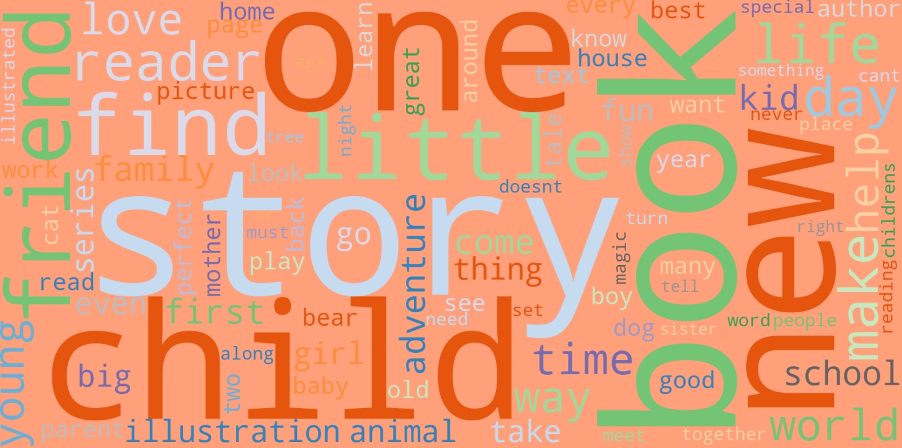

# Children's Book Recommendation - Capstone Project

## Project Background
How to support non-native speaker parents to find the most suitable books for their children? How to help them search for books in a much easier and simpler way?

## Recommendation Mini-APP

[Children's Book Recommendation](https://sileihuo-book-recommend-childrens.streamlit.app/)

## Dataset

**Dataset source**: [USCD Book Graph](https://sites.google.com/eng.ucsd.edu/ucsdbookgraph/home)

Original Children's book data szie: 10M ratings, 128K books, 830K authors

Processed data size (dataset is reduced due to limited resources): 1M reviews, ~40K unique books, ~38K unique users

**Key features**: Book Title, Book Description, Book Ratings

## Text Preprocessing

**NLP(Book Description)**: Conducted word vectorization using **TFIDF** & **NLTK WordNetLemmatizer** on each book's description text data

## Recommendation Systems

- **Content Based Recommendation**: Analyze similarity between each book pair based on **book description text**, recommend top ranked books for unknown users;
- **User-Item Collaborative Recommendation**: Analyze similarity between each book pair based on **user rating** record, recommend top ranked books for unknown users;
- **FunkSVD Recommendation**: **Predict rating** for each book that user haven't read before, and recommend top ranked books to specific known user;

